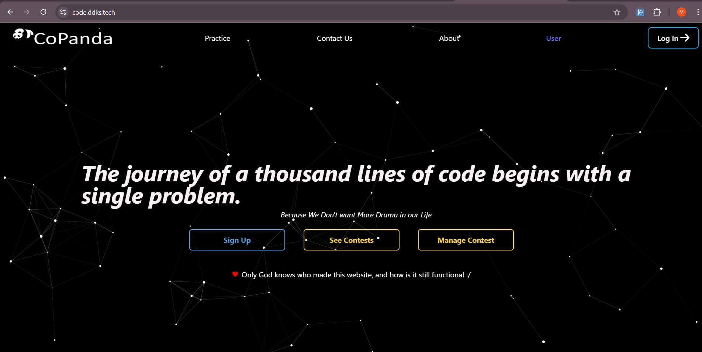

# CoPanda Backend

CoPanda is a coding contest platform that allows users to participate in competitive programming contests. This repository contains the backend code for CoPanda, built using Node.js and Express, with MongoDB as the database. The backend manages user authentication, contest management, problem statements, and code execution using Docker.

## Features
- User authentication and authorization
- Contest creation and management
- Problem statement storage
- Submission and evaluation of code
- Docker-based compiler execution
- WebSocket support for real-time updates

## Live Website
[CoPanda](https://code.ddks.tech/)

## Tech Stack
- **Backend:** Node.js, Express.js
- **Database:** MongoDB
- **Code Execution:** Docker, Dockerode
- **Authentication:** JWT
- **WebSockets:** Socket.io
- **Deployment:** Azure VM, Nginx, Docker

## Installation

### Prerequisites
Ensure you have the following installed:
- Node.js (>=16.x)
- MongoDB
- Docker

### Steps
1. Clone the repository:
   ```bash
   git clone https://github.com/manpreet-singh1040/copanda-backend.git
   cd copanda-backend
   ```
2. Install dependencies:
   ```bash
   npm install
   ```
3. Set up environment variables by creating a `.env` file:
   ```
   # API configs
   PORT=3000

   # Bcrypt configs
   SALT=10

   # JWT configs
   JWTKEY="your key"

   # File exec server
   FXPORT=6996

   # Mongo database
   MONGO_PORT=2017
   SERVER_2_URL="server-2 url"
   # MONGO_URL=mongo
   # MONGO_URL="your mongo url"

   # Redis
   REDIS_URL="your redis url"

   # GitHub OAuth
   GITHUB_NOTELL=for auth
   ```
4. Start the backend server:
   ```bash
   npm start
   ```

## API Endpoints

### Authentication
- `POST /api/auth/register` - Register a new user
- `POST /api/auth/login` - Login user and get JWT token

### Contests
- `GET /api/contests` - Get all contests
- `POST /api/contests` - Create a new contest

### Problems
- `GET /api/problems/:id` - Get problem details
- `POST /api/problems` - Create a new problem

### Submissions
- `POST /api/submissions` - Submit code for evaluation
- `GET /api/submissions/:id` - Get submission status

## Code Execution
CoPanda uses Docker to execute submitted code inside secure containers. Each submission is compiled and run in an isolated environment, ensuring security and fairness.

## Deployment
The backend is deployed using:
- **Azure VM** for hosting
- **Nginx** as a reverse proxy
- **Docker** for containerized execution

To deploy the backend:
1. Build the Docker image:
   ```bash
   docker build -t copanda-backend .
   ```
2. Run the container:
   ```bash
   docker run -d -p 3000:3000 --name copanda-backend --restart always copanda-backend
   ```
3. Configure Nginx to reverse proxy requests to the backend.

## Screenshots



## Contributing
Contributions are welcome! Feel free to fork the repository, create a new branch, and submit a pull request.

## License
This project is licensed under the MIT License.

## Contact
For any issues or suggestions, open an issue on the [GitHub Repository](https://github.com/manpreet-singh1040/copanda-backend).

